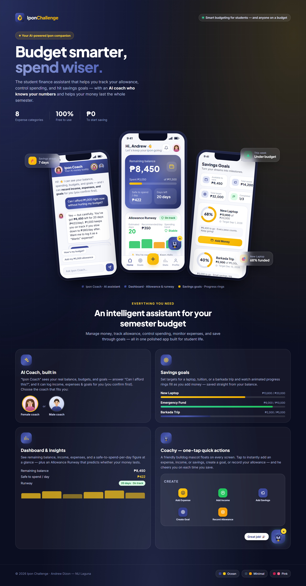

<p align="center">
  <a href="https://personal-finance-budget-tracker-seven.vercel.app">
    
  </a>
</p>

<h1 align="center">Ipon Challenge</h1>

<p align="center">
  <strong>Track your money. Control your spending. Build the saving habit.</strong>
</p>

<p align="center">
  A full-stack personal finance and budget tracker built for students and anyone on a budget.<br/>
  Manage your allowance, log everyday expenses, set savings goals, and build healthy money habits —<br/>
  with an AI coach that knows your numbers and helps your money last.
</p>

<p align="center">
  <a href="https://personal-finance-budget-tracker-seven.vercel.app"><strong>Live App →</strong></a>
  &nbsp;&nbsp;·&nbsp;&nbsp;
  <a href="#-features">Features</a>
  &nbsp;&nbsp;·&nbsp;&nbsp;
  <a href="#-architecture">Architecture</a>
  &nbsp;&nbsp;·&nbsp;&nbsp;
  <a href="#-getting-started">Getting Started</a>
</p>

<p align="center">
  
  
  
  
  
  
  
  
  
</p>

> *Ipon* is the Filipino word for "saving up."

---

## Product Showcase

<p align="center">
  
</p>

<details>
<summary><strong>How to generate the showcase image</strong></summary>

Open `showcase/showcase.html` in Chrome, then use DevTools → **⋮** → **Capture full size screenshot** (set device pixel ratio to 2× for sharper output). Alternatively, use the AI image-generation prompt in `showcase/image-prompt.md` with Midjourney, DALL·E, or Imagen.

</details>

---

## Screenshots

| Dashboard | AI Coach | Savings Goals |
|:-:|:-:|:-:|
|  |  |  |

| Analytics | Mobile View | Dark Mode |
|:-:|:-:|:-:|
|  |  |  |

---

## Features

### 💰 Smart Budget Tracking

- **Allowance Runway 2.0** — daily safe-to-spend, risk level (green / yellow / red), spending trend, estimated exhaustion date, and a 4-week projection chart
- **Recurring allowance automation** — allowance auto-credited on your schedule (daily / weekly / bi-weekly / monthly)
- Fast expense and income logging with ready-made categories (Food, Transportation, Bills, Leisure, Emergency, Tuition, School Supplies, Projects, Load/Data)
- **Semester Budget Mode** — plan a whole semester and get a weekly spending breakdown
- **Before You Buy** — spending-impact check before each expense is saved

### 🎯 Savings Goals

- Create financial goals with target amounts and deadlines
- Animated progress rings and milestone tracking
- Add money from your available balance — automatically deducted
- **Emergency Fund** — dedicated safety-net savings by category (Medical, Transport, School, General)

### 🤖 AI Finance Coach

- Personalized financial insights — the AI sees your real balance, budgets, spending, and goals
- Natural language interaction: *"Can I afford ₱1,000 right now?"*
- Can log income, expenses, and goals on your behalf (you confirm first)
- Choose your coach avatar — female or male assistant
- Powered by Google Gemini with per-user daily caps

### 📊 Analytics & Reports

- Spending breakdown by category with visual charts
- Weekly and monthly spending trends
- **Financial Health Score** — 0–100 score across savings, budget, spending, challenges, and emergency-fund habits
- **Monthly Reports** — exportable as PDF (print) or CSV

### 🏆 Gamification

- XP, levels, no-overspend streaks, and unlockable achievements
- **No-Spend Challenges** — gamified challenges (No Milk Tea, Save ₱50/day, …) that award XP
- **Financial Literacy** — practical lessons with quizzes and a compound-interest calculator
- **School Calendar** — track exams, projects, and tuition deadlines with budget suggestions

### 📱 Progressive Web App

- Install on any device — Android, iOS, desktop — no app store needed
- **Offline-first** — works without internet and auto-syncs when the connection returns
- Light/dark mode with customizable accent colors
- Responsive layout with mobile bottom nav, "More" menu, and quick-add button

### 🐶 Quick Actions (Coachy)

A friendly bulldog mascot FAB floats on every screen — tap to instantly add an expense, income, savings, create a goal, or record your allowance.

---

## Tech Stack

<table>
  <tr>
    <td><strong>Frontend</strong></td>
    <td>React 18 · TypeScript · Vite · Tailwind CSS · Framer Motion · Recharts · Zustand · React Hook Form + Zod · Axios</td>
  </tr>
  <tr>
    <td><strong>Offline / PWA</strong></td>
    <td>vite-plugin-pwa (Workbox) · Dexie (IndexedDB) · Background Sync</td>
  </tr>
  <tr>
    <td><strong>Backend</strong></td>
    <td>Java 17 · Spring Boot 3.2 · Spring Security · Spring Data JPA (Hibernate) · Bean Validation · JJWT · Spring Scheduling</td>
  </tr>
  <tr>
    <td><strong>AI</strong></td>
    <td>Google Gemini API · Context-aware financial assistant</td>
  </tr>
  <tr>
    <td><strong>Database</strong></td>
    <td>PostgreSQL 14+</td>
  </tr>
  <tr>
    <td><strong>Hosting</strong></td>
    <td>Vercel (frontend) · Railway (backend + PostgreSQL)</td>
  </tr>
</table>

---

## Architecture

A clean two-tier application: a **React SPA** communicating over HTTPS with a **stateless Spring Boot REST API**, backed by **PostgreSQL**.

```
┌─────────────────────────────────────────────────┐
│  React + TypeScript SPA  (Vercel)                │
│  Pages · Components · Zustand stores             │
│  Services (Axios) · Offline layer (Dexie)        │
└──────────────────┬──────────────────────────────┘
                   │  HTTPS · JWT Bearer
                   ▼
┌─────────────────────────────────────────────────┐
│  Spring Boot REST API  (Railway)                  │
│                                                   │
│  Controller → Service → Repository → Entity       │
│       (DTO + Mapper)       (Spring Data JPA)      │
│                                                   │
│  Security: JWT filter · Rate limiting · Lockout   │
│  AI Coach: Gemini integration · Daily caps        │
│  Scheduling: Recurring allowance automation       │
└──────────────────┬──────────────────────────────┘
                   │  JDBC (Hibernate)
                   ▼
┌─────────────────────────────────────────────────┐
│  PostgreSQL  (Railway)                            │
└─────────────────────────────────────────────────┘
```

### Project Structure

```
Personal-Finance-Budget-Tracker/
├── src/main/java/com/iponchallenge/   # Spring Boot API
│   ├── controller/                    # REST endpoints
│   ├── service/                       # Business logic
│   ├── repository/                    # Spring Data JPA repositories
│   ├── entity/  dto/  mapper/         # Domain model, API contracts, mapping
│   ├── security/  config/             # JWT, rate limiting, CORS, headers
│   ├── ai/                            # AI Coach (Gemini integration)
│   └── exception/                     # Centralized error handling
├── frontend/                          # React + TypeScript PWA
│   └── src/
│       ├── pages/  components/        # Screens and UI building blocks
│       ├── store/                     # Zustand state management
│       ├── services/  api/            # Typed API clients
│       ├── db/  sync/                 # IndexedDB + SyncManager
│       └── lib/                       # Helpers, animations, theming
├── showcase/                          # Product images and showcase assets
├── docs/                              # Technical documentation
├── ARCHITECTURE.md                    # Detailed architecture reference
└── CHANGELOG.md                       # Sprint-by-sprint feature log
```

For a detailed breakdown of packages, data models, request lifecycle, and technology decisions, see [ARCHITECTURE.md](ARCHITECTURE.md).

---

## Security

- **Authentication** — JWT bearer tokens with BCrypt password hashing and token-versioning for full session revocation (logout all devices, password change invalidation)
- **Password policy** — minimum 12 characters with upper, lower, number, and symbol — enforced on both client and server
- **Brute-force protection** — account lockout after repeated failures plus per-IP rate limiting on auth endpoints
- **Authorization** — role-based access control (`STUDENT` / `ADMIN`) enforced server-side; all data access scoped to the authenticated user
- **Hardening** — CSP, HSTS, X-Frame-Options, Referrer-Policy, Permissions-Policy, strict input validation, request-size limits, generic error responses

---

## Getting Started

### Prerequisites

- Java 17+ and Maven
- Node.js 18+ and npm
- PostgreSQL 14+

### Backend

Create a database, then configure via environment variables:

| Variable | Description | Default |
|---|---|---|
| `PGHOST` / `PGPORT` / `PGDATABASE` | Postgres connection | `localhost` / `5432` / `ipon_challenge` |
| `PGUSER` / `PGPASSWORD` | Postgres credentials | `postgres` / `postgres` |
| `JWT_SECRET` | JWT signing key (**required**) | — |
| `ALLOWED_ORIGINS` | Comma-separated CORS origins | `http://localhost:5173` |
| `AI_API_KEY` | Google Gemini API key (enables AI Coach) | unset |
| `AI_MODEL` | Gemini model id | `gemini-2.5-flash-lite` |

```bash
mvn spring-boot:run
```

The API starts at `http://localhost:8080`.

### Frontend

```bash
cd frontend
npm install
npm run dev
```

The app runs at `http://localhost:5173`. To point at a non-default API, set `VITE_API_URL` in `frontend/.env`:

```
VITE_API_URL=http://localhost:8080
```

### Install as PWA

Open the live app, then:

- **Android (Chrome):** ⋮ menu → Add to Home screen → Install
- **iPhone/iPad (Safari):** Share → Add to Home Screen
- **Desktop (Chrome/Edge):** click the install icon (⊕) in the address bar

Once installed, the app opens full-screen, keeps you logged in, and works offline.

---

## Deployment

| Service | Platform | Trigger |
|---|---|---|
| Frontend | Vercel | Auto-deploy on push to `main` |
| Backend + DB | Railway | Auto-deploy on push to `main` |

Security headers are configured via `vercel.json` (CSP, HSTS, X-Frame-Options). The backend reads all configuration from environment variables.

---

## Roadmap

- Advanced AI financial insights and spending predictions
- Refresh-token rotation with HTTP-only cookies
- Push notifications for budget alerts and school events
- Multi-month report comparisons and trend analysis
- Enhanced customization and theming options

---

## License

Released under the **MIT License** — see [LICENSE](LICENSE) for details.

NU Laguna branding elements are used for an educational, non-commercial project and remain the property of National University Laguna. See also the in-app [Terms of Service](https://personal-finance-budget-tracker-seven.vercel.app/terms) and [Privacy Policy](https://personal-finance-budget-tracker-seven.vercel.app/privacy).

---

<p align="center">
  Built as a full-stack portfolio project for <strong>National University Laguna</strong> by <a href="https://github.com/AndrewDizon0556">Vic Andrew A. Dizon</a>.
</p>
